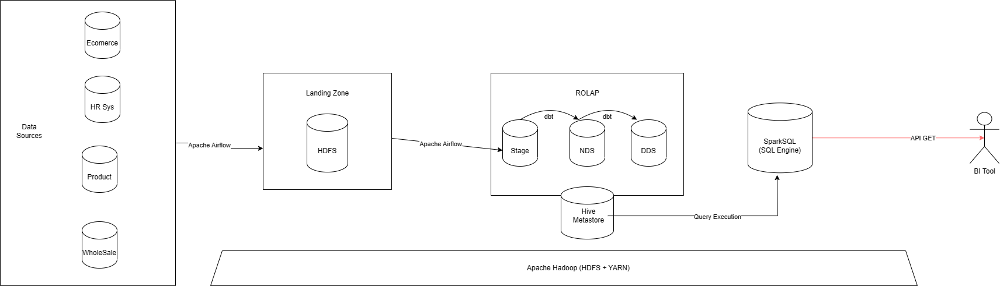

# WholeSaling-DataWarehouse

## Set up:

Firstly, when having set up the infra, we need to create the database:
```SQL
    CREATE DATABASE dw_{$USER}_staging;
```

After within this database, we need to create the resolved data quality:
```SQL
    CREATE TABLE resolved_data_quality(id string, source string) USING delta;
```

## Software Architecture:
